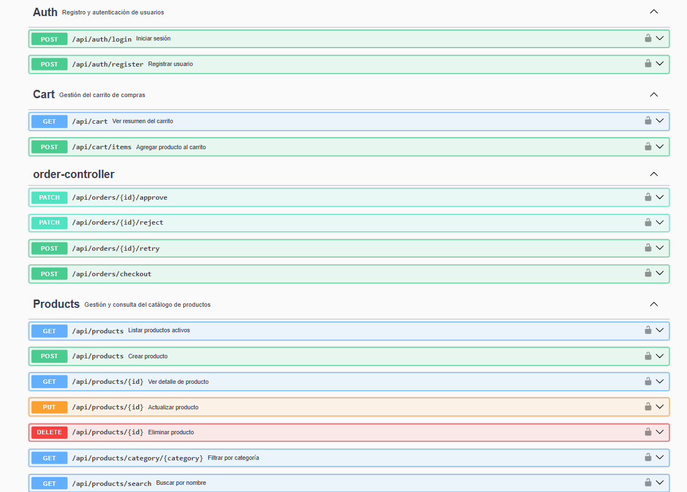
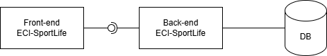

# ECI-SportLife

SportLife es una tienda virtual de productos deportivos desarrollada como MVP (Mínimo Producto Viable) por DOSW. Expone servicios REST para gestionar usuarios, productos, carrito de compras y pagos.

---

## Índice

1. [Matriz de Trazabilidad de Funcionalidades](#1-matriz-de-trazabilidad-de-funcionalidades)
2. [Verbos HTTP por Funcionalidad](#2-verbos-http-por-funcionalidad)
3. [Idempotencia por Funcionalidad](#3-idempotencia-por-funcionalidad)
4. [Entradas, Salidas, Ejemplos y Validaciones](#4-entradas-salidas-ejemplos-y-validaciones-por-funcionalidad)
5. [Códigos HTTP: Happy Path y Flujo de Error](#5-códigos-http-happy-path-y-flujo-de-error)
6. [Seguridad de la Aplicación](#6-seguridad-de-la-aplicación)
7. [Roles y Permisos](#7-roles-y-permisos)
8. [TLS/SSL en una API REST](#8-tlsssl-en-una-api-rest)
9. [CORS en una API REST](#9-cors-en-una-api-rest)
10. [Diseño de Pantallas — Figma](#10-diseño-de-pantallas--figma)
11. [Capturas del Proyecto](#11-capturas-del-proyecto)

---

## 1. Matriz de Trazabilidad de Funcionalidades

### ¿Qué es una matriz de trazabilidad?

Cuando recibes un documento con requisitos (como el enunciado de SportLife), tu trabajo como desarrollador no es arrancar a codificar de inmediato. Primero debes **leer, entender y organizar** lo que se pide.

Una **matriz de trazabilidad** es una tabla que te permite:

- **Listar** todas las funcionalidades que el sistema debe tener.
- **Asignar prioridad** a cada una (¿qué va primero?).
- **Identificar dependencias** (¿qué necesita existir antes para que otra funcionalidad funcione?).

Esto evita que construyas algo que nadie pidió, o que intentes implementar el pago antes de tener usuarios registrados.

---

### ¿Cómo se identifican las funcionalidades?

Se lee el enunciado y se extraen las **acciones que el sistema debe permitir hacer**. Una buena señal son frases como:
- *"Los usuarios podrán..."*
- *"El sistema se encargará de..."*
- *"En caso de que el pago sea aprobado..."*

Cada una de esas frases esconde una o varias funcionalidades.

---

### Funcionalidades identificadas en SportLife

| ID   | Funcionalidad                              | Descripción                                                                 |
|------|--------------------------------------------|-----------------------------------------------------------------------------|
| F-01 | Registro de usuario                        | El usuario crea una cuenta con nombre, correo y contraseña                  |
| F-02 | Autenticación (Login)                      | El usuario inicia sesión y recibe un token de acceso (JWT)                  |
| F-03 | Listar productos                           | Consultar el catálogo de productos activos                                  |
| F-04 | Filtrar productos por categoría            | Filtrar el catálogo según categoría (running, gimnasio, etc.)               |
| F-05 | Buscar productos por nombre                | Buscar un producto por su nombre                                            |
| F-06 | Ver detalle de un producto                 | Ver toda la información de un producto específico                           |
| F-07 | Agregar producto al carrito                | Seleccionar un producto y cantidad; valida stock disponible                 |
| F-08 | Ver resumen del carrito                    | Listar productos, cantidades, subtotales y total del carrito                |
| F-09 | Iniciar proceso de pago                    | Validar carrito, calcular total y generar orden de compra                   |
| F-10 | Pago aprobado                              | Cambiar orden a PAID, descontar stock, mostrar confirmación con ID          |
| F-11 | Pago rechazado                             | Cambiar orden a REJECTED, no afectar stock, notificar al usuario            |
| F-12 | Reintentar pago                            | Permitir al usuario volver a intentar el pago tras un rechazo               |
| F-13 | Gestión de productos (CRUD)                | Crear, editar, activar/inactivar productos del catálogo                     |

---

### Matriz de trazabilidad con prioridad y dependencias

La **prioridad** indica qué tan urgente es construir esa funcionalidad para que el MVP funcione. Se usa una escala simple:

- **Alta**: sin esto el sistema no existe.
- **Media**: mejora la experiencia, pero puede esperar una iteración.
- **Baja**: deseable, pero no crítico para el MVP.

La columna **"Depende de"** indica qué funcionalidad debe estar lista antes de poder construir esta.

La columna **"Bloquea a"** indica qué funcionalidades no pueden existir si esta no se implementa primero.

| ID   | Funcionalidad               | Prioridad | Depende de        | Bloquea a                  | Justificación                                                                 |
|------|-----------------------------|-----------|-------------------|----------------------------|-------------------------------------------------------------------------------|
| F-01 | Registro de usuario         | Alta      | —                 | F-02, F-07, F-08, F-09     | Sin usuarios registrados no hay flujo posible                                 |
| F-02 | Autenticación (Login)       | Alta      | F-01              | F-07, F-08, F-09           | Sin login no se puede proteger ninguna operación del usuario                  |
| F-13 | Gestión de productos        | Alta      | —                 | F-03, F-04, F-05, F-06     | Sin productos en el sistema no hay catálogo que mostrar                       |
| F-03 | Listar productos            | Alta      | F-13              | F-07                       | El usuario necesita ver el catálogo para poder agregar al carrito              |
| F-06 | Ver detalle de producto     | Alta      | F-13              | —                          | Información completa necesaria antes de comprar                               |
| F-04 | Filtrar por categoría       | Media     | F-03              | —                          | Mejora la navegación pero no bloquea el flujo de compra                       |
| F-05 | Buscar por nombre           | Media     | F-03              | —                          | Igual que el filtro, es una mejora de usabilidad                              |
| F-07 | Agregar al carrito          | Alta      | F-02, F-03        | F-08, F-09                 | Núcleo del flujo de compra; requiere usuario autenticado y productos           |
| F-08 | Ver resumen del carrito     | Alta      | F-07              | F-09                       | Paso obligatorio antes de iniciar el pago                                     |
| F-09 | Iniciar proceso de pago     | Alta      | F-08              | F-10, F-11                 | Genera la orden y desencadena el resultado del pago                           |
| F-10 | Pago aprobado               | Alta      | F-09              | —                          | Resultado positivo del flujo; actualiza stock y confirma al usuario           |
| F-11 | Pago rechazado              | Alta      | F-09              | F-12                       | Resultado negativo; debe manejarse para no dejar la orden en estado inválido  |
| F-12 | Reintentar pago             | Media     | F-11              | —                          | Mejora la experiencia tras un rechazo, pero no bloquea el MVP                 |

---

### Lectura del flujo de dependencias

Si representas las dependencias como una cadena, el flujo crítico del MVP es:

```
F-13 (productos)
    └── F-03 (listar)
            └── F-07 (agregar al carrito)
                    └── F-08 (ver carrito)
                            └── F-09 (iniciar pago)
                                    ├── F-10 (pago aprobado)
                                    └── F-11 (pago rechazado)
                                                └── F-12 (reintentar)

F-01 (registro)
    └── F-02 (login)
            └── F-07 (agregar al carrito)
```

Esto significa que si F-01 o F-13 no existen, **ninguna otra funcionalidad puede funcionar**. Son los cimientos del sistema.

---

### Conclusión


1. F-01 → Registro
2. F-02 → Login
3. F-13 → Gestión de productos
4. F-03, F-06 → Listar y ver detalle
5. F-07 → Carrito
6. F-08 → Resumen del carrito
7. F-09, F-10, F-11 → Pago y sus resultados
8. F-04, F-05, F-12 → Filtros, búsqueda y reintento

---

## 2. Verbos HTTP por Funcionalidad

### ¿Qué es un verbo HTTP?

Cuando un cliente (navegador, app móvil, Postman) se comunica con un servidor REST, no solo le dice *a dónde* quiere ir (la URL), sino también *qué quiere hacer*. Eso es el **verbo HTTP**: la intención de la solicitud.

Los cuatro verbos fundamentales son:

| Verbo    | Intención                          | Analogía cotidiana                        |
|----------|------------------------------------|-------------------------------------------|
| `GET`    | Leer / consultar información       | Ir a una biblioteca y pedir un libro      |
| `POST`   | Crear algo nuevo                   | Llenar y entregar un formulario           |
| `PUT`    | Reemplazar un recurso completo     | Borrar una página y escribirla de nuevo   |
| `PATCH`  | Modificar solo una parte           | Tachar una palabra y corregirla           |
| `DELETE` | Eliminar un recurso                | Sacar un libro del estante y destruirlo   |

La regla de oro: **el verbo describe la acción, la URL describe el recurso**.  
Por ejemplo: `POST /users` significa "crea un usuario nuevo", mientras que `GET /users` significa "dame la lista de usuarios".


### Verbos HTTP por funcionalidad en SportLife

| ID   | Funcionalidad               | Verbo HTTP        | Justificación                                                                 |
|------|-----------------------------|-------------------|-------------------------------------------------------------------------------|
| F-01 | Registro de usuario         | `POST`            | Se crea un recurso nuevo: la cuenta del usuario                               |
| F-02 | Autenticación (Login)       | `POST`            | Se envían credenciales para generar un token; no es una consulta, es una acción |
| F-03 | Listar productos            | `GET`             | Solo se consulta el catálogo, no se modifica nada                             |
| F-04 | Filtrar por categoría       | `GET`             | Es una consulta con parámetros (`?category=running`), sin efecto en el servidor |
| F-05 | Buscar por nombre           | `GET`             | Es una consulta con parámetros (`?name=camiseta`), sin efecto en el servidor  |
| F-06 | Ver detalle de producto     | `GET`             | Se lee la información de un producto específico por su ID                     |
| F-07 | Agregar al carrito          | `POST`            | Se crea una nueva entrada en el carrito del usuario                           |
| F-08 | Ver resumen del carrito     | `GET`             | Se consulta el estado actual del carrito sin modificarlo                      |
| F-09 | Iniciar proceso de pago     | `POST`            | Se genera una nueva orden de compra a partir del carrito                      |
| F-10 | Pago aprobado               | `PATCH`           | Solo cambia el estado de la orden existente a `PAID` y descuenta el stock     |
| F-11 | Pago rechazado              | `PATCH`           | Solo cambia el estado de la orden existente a `REJECTED`                      |
| F-12 | Reintentar pago             | `POST`            | Se genera una nueva intentona de pago sobre la orden rechazada                |
| F-13 | Gestión de productos (CRUD) | `POST` / `GET` / `PUT` / `DELETE` | Crear, leer, actualizar y eliminar productos del catálogo |

---

### ¿Por qué login es POST y no GET?

Es una duda muy común. Intuitivamente parece que hacer login es "consultar si mis credenciales son correctas", lo que llevaría a usar `GET`. Sin embargo:

1. `GET` no tiene cuerpo (body) en la solicitud. Las credenciales irían en la URL, lo que es un riesgo de seguridad grave (quedan en logs, historial del navegador, etc.).
2. El login **genera** un recurso nuevo: el token de sesión. Crear algo es responsabilidad de `POST`.
3. Es la convención aceptada en la industria.

### ¿Por qué el pago aprobado/rechazado es PATCH y no POST?

La orden ya existe (fue creada en F-09). El pago no crea una nueva orden, solo **actualiza su estado**. Como solo se modifica un campo del recurso (el estado), el verbo correcto es `PATCH`. Si se usara `PUT`, implicaría reemplazar la orden completa, lo que no es la intención.

---

## 3. Idempotencia por Funcionalidad

### ¿Qué es la idempotencia?

Una operación es **idempotente** si ejecutarla una vez produce el mismo resultado que ejecutarla diez veces seguidas. El estado final del sistema es idéntico sin importar cuántas veces se repita la llamada.

Ejemplo sencillo:
- Encender una luz que ya está encendida → sigue encendida. **Idempotente.**
- Depositar $100 en una cuenta → cada depósito suma $100 más. **No idempotente.**


---

### Idempotencia por verbo HTTP (regla general)

| Verbo    | ¿Idempotente? | Razón                                                                  |
|----------|---------------|------------------------------------------------------------------------|
| `GET`    | Sí            | Solo lee, nunca modifica el estado del servidor                        |
| `PUT`    | Sí            | Reemplaza el recurso con el mismo valor; el resultado siempre es igual |
| `DELETE` | Sí            | Borrar algo ya borrado deja el sistema en el mismo estado              |
| `PATCH`  | Depende       | Si fija un valor concreto es idempotente; si incrementa, no lo es      |
| `POST`   | No            | Cada llamada generalmente crea un nuevo recurso                        |

---

### Análisis por funcionalidad

| ID   | Funcionalidad                | Verbo    | ¿Idempotente? | Razón técnica                                                                                                |
|------|------------------------------|----------|---------------|--------------------------------------------------------------------------------------------------------------|
| F-01 | Registro de usuario          | `POST`   | No            | Cada llamada intenta crear un usuario nuevo. Dos llamadas con el mismo correo generan conflicto o duplicado  |
| F-02 | Autenticación (Login)        | `POST`   | No            | Cada llamada genera un token JWT distinto (diferente `iat`, diferente firma). El estado cambia con cada sesión |
| F-03 | Listar productos             | `GET`    | Sí            | Solo consulta el catálogo. Llamarla N veces devuelve la misma lista sin alterar nada                         |
| F-04 | Filtrar por categoría        | `GET`    | Sí            | Es una lectura filtrada. No modifica el estado del servidor en ningún caso                                   |
| F-05 | Buscar por nombre            | `GET`    | Sí            | Es una lectura con parámetro de búsqueda. Nunca muta datos                                                   |
| F-06 | Ver detalle de producto      | `GET`    | Sí            | Devuelve los datos de un producto por ID. Repetirla no cambia nada                                           |
| F-07 | Agregar al carrito           | `POST`   | No            | Cada llamada agrega una nueva línea o incrementa la cantidad. Llamarla dos veces agrega el doble             |
| F-08 | Ver resumen del carrito      | `GET`    | Sí            | Solo lee el estado actual del carrito. No lo modifica                                                        |
| F-09 | Iniciar proceso de pago      | `POST`   | No            | Cada llamada genera una nueva orden de compra con un ID único. Dos llamadas = dos órdenes                    |
| F-10 | Pago aprobado                | `PATCH`  | No            | Fijar el estado a `PAID` es idempotente, pero el descuento de stock es un efecto secundario acumulativo      |
| F-11 | Pago rechazado               | `PATCH`  | Sí            | Solo cambia el estado a `REJECTED`. No toca el stock. Aplicarlo múltiples veces deja el sistema igual        |
| F-12 | Reintentar pago              | `POST`   | No            | Cada reintento es un nuevo intento de pago independiente; puede generar múltiples cobros sin control         |
| F-13 | Gestión productos: crear     | `POST`   | No            | Crea un producto nuevo cada vez; dos llamadas iguales producen dos productos                                  |
| F-13 | Gestión productos: leer      | `GET`    | Sí            | Solo consulta, no muta                                                                                       |
| F-13 | Gestión productos: editar    | `PUT`    | Sí            | Reemplaza el producto completo con los mismos datos; el resultado siempre es idéntico                        |
| F-13 | Gestión productos: eliminar  | `DELETE` | Sí            | Eliminar un producto ya borrado no cambia el estado del sistema                                              |

---

## 4. Entradas, Salidas, Ejemplos y Validaciones por Funcionalidad

### ¿Cómo leer esta sección?

Para cada funcionalidad se definen:

- **Entradas:** los datos que el cliente envía al servidor (en el body, en la URL o en headers).
- **Salidas:** los datos que el servidor devuelve al cliente.
- **Ejemplo:** cómo se ve esa comunicación en formato JSON real.
- **Validaciones de input:** reglas que se verifican antes de ejecutar la lógica (formato, longitud, presencia).
- **Validaciones de negocio:** reglas que dependen del estado actual del sistema (¿existe este usuario? ¿hay stock?).

La distinción entre validación de input y de negocio es importante: las de input se pueden verificar antes de tocar la base de datos; las de negocio requieren consultar el sistema.

---

### F-01 — Registro de usuario

**Entrada**

| Campo      | Tipo     | Obligatorio | Descripción                                               |
|------------|----------|-------------|-----------------------------------------------------------|
| `name`     | `String` | Sí          | Nombre completo del usuario                               |
| `email`    | `String` | Sí          | Correo electrónico único                                  |
| `password` | `String` | Sí          | Contraseña en texto plano (se almacenará cifrada)         |

**Salida**

| Campo       | Tipo       | Siempre presente | Descripción                     |
|-------------|------------|------------------|---------------------------------|
| `id`        | `UUID`     | Sí               | Identificador único del usuario |
| `name`      | `String`   | Sí               | Nombre registrado               |
| `email`     | `String`   | Sí               | Correo registrado               |
| `createdAt` | `DateTime` | Sí               | Fecha y hora de creación        |

**Ejemplo**

```json
// POST /api/auth/register
// Request
{
  "name": "Juan Pérez",
  "email": "juan@ejemplo.com",
  "password": "MiClave$123"
}

// Response 201 Created
{
  "id": "a1b2c3d4-e5f6-7890-abcd-ef1234567890",
  "name": "Juan Pérez",
  "email": "juan@ejemplo.com",
  "createdAt": "2025-04-09T10:30:00Z"
}
```

**Validaciones de input**
- `name`: no vacío, entre 2 y 100 caracteres.
- `email`: formato válido (`usuario@dominio.com`), máximo 150 caracteres.
- `password`: mínimo 8 caracteres, al menos una mayúscula, un número y un carácter especial.

**Validaciones de negocio**
- El `email` no debe estar registrado previamente en el sistema.
- La contraseña nunca se almacena en texto plano; se aplica hash con BCrypt antes de guardar.

---

### F-02 — Autenticación (Login)

**Entrada**

| Campo      | Tipo     | Obligatorio | Descripción               |
|------------|----------|-------------|---------------------------|
| `email`    | `String` | Sí          | Correo del usuario        |
| `password` | `String` | Sí          | Contraseña en texto plano |

**Salida**

| Campo       | Tipo     | Siempre presente | Descripción                                  |
|-------------|----------|------------------|----------------------------------------------|
| `token`     | `String` | Sí               | Token JWT para autenticar futuras peticiones |
| `tokenType` | `String` | Sí               | Siempre `"Bearer"`                           |
| `expiresIn` | `Long`   | Sí               | Segundos hasta que el token expira           |

**Ejemplo**

```json
// POST /api/auth/login
// Request
{
  "email": "juan@ejemplo.com",
  "password": "MiClave$123"
}

// Response 200 OK
{
  "token": "eyJhbGciOiJIUzI1NiIsInR5cCI6IkpXVCJ9...",
  "tokenType": "Bearer",
  "expiresIn": 3600
}
```

**Validaciones de input**
- `email`: formato válido, no vacío.
- `password`: no vacío.

**Validaciones de negocio**
- El `email` debe existir en el sistema.
- La contraseña debe coincidir con el hash almacenado.
- El usuario debe estar activo.
- Siempre se retorna el mismo mensaje genérico en caso de error (`"Credenciales inválidas"`) para no revelar si el correo existe.

---

### F-03 — Listar productos

**Entrada**

| Campo  | Tipo      | Obligatorio | Descripción                             |
|--------|-----------|-------------|-----------------------------------------|
| `page` | `Integer` | No          | Número de página (por defecto `0`)      |
| `size` | `Integer` | No          | Elementos por página (por defecto `10`) |

**Salida**

| Campo        | Tipo             | Siempre presente | Descripción                      |
|--------------|------------------|------------------|----------------------------------|
| `content`    | `List<Producto>` | Sí               | Lista de productos de la página  |
| `totalItems` | `Long`           | Sí               | Total de productos en el sistema |
| `totalPages` | `Integer`        | Sí               | Total de páginas disponibles     |
| `currentPage`| `Integer`        | Sí               | Página actual                    |

**Ejemplo**

```json
// GET /api/products?page=0&size=2
// Response 200 OK
{
  "content": [
    {
      "id": "prod-001",
      "name": "Camiseta Running Dry-Fit",
      "category": "RUNNING",
      "price": 79900,
      "stock": 45,
      "status": "ACTIVE"
    },
    {
      "id": "prod-002",
      "name": "Guantes de Gimnasio",
      "category": "GIMNASIO",
      "price": 35000,
      "stock": 12,
      "status": "ACTIVE"
    }
  ],
  "totalItems": 38,
  "totalPages": 19,
  "currentPage": 0
}
```

**Validaciones de input**
- `page`: debe ser >= 0.
- `size`: debe estar entre 1 y 100.

**Validaciones de negocio**
- Solo se retornan productos con `status = ACTIVE`.
- Si no hay productos, se retorna lista vacía (nunca `404`).

---

### F-04 — Filtrar por categoría

**Entrada**

| Campo      | Tipo      | Obligatorio | Descripción                                                   |
|------------|-----------|-------------|---------------------------------------------------------------|
| `category` | `String`  | Sí          | Categoría a filtrar (`RUNNING`, `GIMNASIO`, `CICLISMO`, etc.) |
| `page`     | `Integer` | No          | Número de página                                              |
| `size`     | `Integer` | No          | Elementos por página                                          |

**Salida:** misma estructura paginada que F-03.

**Ejemplo**

```json
// GET /api/products?category=RUNNING&page=0&size=10
// Response 200 OK
{
  "content": [
    {
      "id": "prod-001",
      "name": "Camiseta Running Dry-Fit",
      "category": "RUNNING",
      "price": 79900,
      "stock": 45,
      "status": "ACTIVE"
    }
  ],
  "totalItems": 7,
  "totalPages": 1,
  "currentPage": 0
}
```

**Validaciones de input**
- `category`: no vacío, debe ser un valor del enum permitido. Valor desconocido retorna `400 Bad Request`.

**Validaciones de negocio**
- Solo se retornan productos activos de esa categoría.

---

### F-05 — Buscar por nombre

**Entrada**

| Campo  | Tipo      | Obligatorio | Descripción               |
|--------|-----------|-------------|---------------------------|
| `name` | `String`  | Sí          | Término de búsqueda       |
| `page` | `Integer` | No          | Número de página          |
| `size` | `Integer` | No          | Elementos por página      |

**Salida:** misma estructura paginada que F-03.

**Ejemplo**

```json
// GET /api/products?name=guante&page=0&size=10
// Response 200 OK
{
  "content": [
    {
      "id": "prod-002",
      "name": "Guantes de Gimnasio",
      "category": "GIMNASIO",
      "price": 35000,
      "stock": 12,
      "status": "ACTIVE"
    }
  ],
  "totalItems": 1,
  "totalPages": 1,
  "currentPage": 0
}
```

**Validaciones de input**
- `name`: mínimo 2 caracteres.

**Validaciones de negocio**
- Búsqueda insensible a mayúsculas/minúsculas (`LIKE %guante%`).
- Solo se retornan productos activos.
- Sin coincidencias retorna lista vacía.

---

### F-06 — Ver detalle de producto

**Entrada**

| Campo       | Tipo   | Obligatorio  | Descripción                      |
|-------------|--------|--------------|----------------------------------|
| `productId` | `UUID` | Sí (en URL)  | Identificador único del producto |

**Salida**

| Campo         | Tipo           | Siempre presente | Descripción                       |
|---------------|----------------|------------------|-----------------------------------|
| `id`          | `UUID`         | Sí               | Identificador único               |
| `name`        | `String`       | Sí               | Nombre del producto               |
| `description` | `String`       | Sí               | Descripción detallada             |
| `category`    | `String`       | Sí               | Categoría del producto            |
| `price`       | `BigDecimal`   | Sí               | Precio en pesos                   |
| `stock`       | `Integer`      | Sí               | Unidades disponibles              |
| `images`      | `List<String>` | Sí               | URLs de las imágenes del producto |
| `status`      | `String`       | Sí               | `ACTIVE` o `INACTIVE`            |

**Ejemplo**

```json
// GET /api/products/prod-001
// Response 200 OK
{
  "id": "prod-001",
  "name": "Camiseta Running Dry-Fit",
  "description": "Camiseta técnica de secado rápido ideal para entrenamientos de alta intensidad.",
  "category": "RUNNING",
  "price": 79900.00,
  "stock": 45,
  "images": [
    "https://cdn.sportlife.com/prod-001-front.jpg",
    "https://cdn.sportlife.com/prod-001-back.jpg"
  ],
  "status": "ACTIVE"
}
```

**Validaciones de input**
- `productId`: debe ser un UUID válido.

**Validaciones de negocio**
- El producto debe existir; si no, `404 Not Found`.
- Si está `INACTIVE`, se retorna `404 Not Found` para usuarios normales.

---

### F-07 — Agregar producto al carrito

**Entrada**

| Campo       | Tipo      | Obligatorio | Descripción                    |
|-------------|-----------|-------------|--------------------------------|
| `productId` | `UUID`    | Sí          | Producto que se quiere agregar |
| `quantity`  | `Integer` | Sí          | Cantidad deseada               |

**Salida**

| Campo         | Tipo         | Siempre presente | Descripción                            |
|---------------|--------------|------------------|----------------------------------------|
| `cartItemId`  | `UUID`       | Sí               | ID del ítem en el carrito              |
| `productId`   | `UUID`       | Sí               | ID del producto                        |
| `productName` | `String`     | Sí               | Nombre del producto                    |
| `quantity`    | `Integer`    | Sí               | Cantidad agregada                      |
| `unitPrice`   | `BigDecimal` | Sí               | Precio unitario al momento de agregar  |
| `subtotal`    | `BigDecimal` | Sí               | `unitPrice * quantity`                 |

**Ejemplo**

```json
// POST /api/cart/items
// Request
{
  "productId": "prod-001",
  "quantity": 2
}

// Response 201 Created
{
  "cartItemId": "item-abc-123",
  "productId": "prod-001",
  "productName": "Camiseta Running Dry-Fit",
  "quantity": 2,
  "unitPrice": 79900.00,
  "subtotal": 159800.00
}
```

**Validaciones de input**
- `productId`: UUID válido, no vacío.
- `quantity`: entero positivo, mínimo `1`.

**Validaciones de negocio**
- El producto debe existir y estar `ACTIVE`.
- La cantidad solicitada no debe superar el stock disponible.
- Si el producto ya está en el carrito, se suma la cantidad (no se duplica el ítem).
- La suma de cantidad existente más la nueva no debe superar el stock.
- El usuario debe estar autenticado.

---

### F-08 — Ver resumen del carrito

**Entrada**

| Campo | Tipo | Obligatorio | Descripción                                        |
|-------|------|-------------|----------------------------------------------------|
| —     | —    | —           | No requiere body. El usuario se identifica por JWT |

**Salida**

| Campo       | Tipo             | Siempre presente | Descripción                            |
|-------------|------------------|------------------|----------------------------------------|
| `items`     | `List<CartItem>` | Sí               | Lista de productos en el carrito       |
| `total`     | `BigDecimal`     | Sí               | Suma de todos los subtotales           |
| `itemCount` | `Integer`        | Sí               | Número total de unidades en el carrito |

**Ejemplo**

```json
// GET /api/cart
// Response 200 OK
{
  "items": [
    {
      "cartItemId": "item-abc-123",
      "productName": "Camiseta Running Dry-Fit",
      "quantity": 2,
      "unitPrice": 79900.00,
      "subtotal": 159800.00
    },
    {
      "cartItemId": "item-def-456",
      "productName": "Guantes de Gimnasio",
      "quantity": 1,
      "unitPrice": 35000.00,
      "subtotal": 35000.00
    }
  ],
  "total": 194800.00,
  "itemCount": 3
}
```

**Validaciones de input**
- Ninguna. Solo requiere el token JWT en el header `Authorization`.

**Validaciones de negocio**
- Si el carrito está vacío se retorna la estructura con listas vacías y total en `0` (no un error).
- El usuario debe estar autenticado.

---

### F-09 — Iniciar proceso de pago

**Entrada**

| Campo           | Tipo     | Obligatorio | Descripción                                               |
|-----------------|----------|-------------|-----------------------------------------------------------|
| `paymentMethod` | `String` | Sí          | Método de pago (`CREDIT_CARD`, `DEBIT_CARD`, `PSE`)       |
| `paymentToken`  | `String` | Sí          | Token generado por la pasarela de pagos                   |

**Salida**

| Campo       | Tipo         | Siempre presente | Descripción                          |
|-------------|--------------|------------------|--------------------------------------|
| `orderId`   | `UUID`       | Sí               | ID único de la orden generada        |
| `status`    | `String`     | Sí               | Estado inicial: `PENDING`            |
| `total`     | `BigDecimal` | Sí               | Total calculado a pagar              |
| `createdAt` | `DateTime`   | Sí               | Fecha y hora de creación de la orden |

**Ejemplo**

```json
// POST /api/orders/checkout
// Request
{
  "paymentMethod": "CREDIT_CARD",
  "paymentToken": "tok_visa_sandbox_abc123"
}

// Response 201 Created
{
  "orderId": "order-xyz-789",
  "status": "PENDING",
  "total": 194800.00,
  "createdAt": "2025-04-09T11:00:00Z"
}
```

**Validaciones de input**
- `paymentMethod`: debe ser un valor del enum permitido.
- `paymentToken`: no vacío.

**Validaciones de negocio**
- El carrito del usuario no debe estar vacío.
- Para cada producto del carrito, el stock actual debe seguir siendo suficiente.
- El usuario debe estar autenticado.

---

### F-10 — Pago aprobado

**Entrada**

| Campo           | Tipo     | Obligatorio  | Descripción                       |
|-----------------|----------|--------------|-----------------------------------|
| `orderId`       | `UUID`   | Sí (en URL)  | ID de la orden a confirmar        |
| `transactionId` | `String` | Sí           | ID de transacción de la pasarela  |

**Salida**

| Campo           | Tipo         | Siempre presente | Descripción                             |
|-----------------|--------------|------------------|-----------------------------------------|
| `orderId`       | `UUID`       | Sí               | ID de la orden                          |
| `status`        | `String`     | Sí               | `PAID`                                  |
| `transactionId` | `String`     | Sí               | Identificador único de la transacción   |
| `total`         | `BigDecimal` | Sí               | Total pagado                            |
| `message`       | `String`     | Sí               | Mensaje de confirmación para el usuario |

**Ejemplo**

```json
// PATCH /api/orders/order-xyz-789/approve
// Request
{
  "transactionId": "TXN-20250409-001"
}

// Response 200 OK
{
  "orderId": "order-xyz-789",
  "status": "PAID",
  "transactionId": "TXN-20250409-001",
  "total": 194800.00,
  "message": "Tu compra fue exitosa. ¡Gracias por comprar en SportLife!"
}
```

**Validaciones de input**
- `transactionId`: no vacío.

**Validaciones de negocio**
- La orden debe existir y estar en estado `PENDING`.
- Se descuenta el stock de cada producto de la orden.
- Si un producto ya no tiene stock suficiente, el pago se rechaza automáticamente.
- El carrito del usuario se vacía tras la confirmación.

---

### F-11 — Pago rechazado

**Entrada**

| Campo     | Tipo     | Obligatorio  | Descripción                      |
|-----------|----------|--------------|----------------------------------|
| `orderId` | `UUID`   | Sí (en URL)  | ID de la orden rechazada         |
| `reason`  | `String` | No           | Motivo del rechazo de la pasarela|

**Salida**

| Campo     | Tipo     | Siempre presente | Descripción                         |
|-----------|----------|------------------|-------------------------------------|
| `orderId` | `UUID`   | Sí               | ID de la orden                      |
| `status`  | `String` | Sí               | `REJECTED`                          |
| `reason`  | `String` | No               | Motivo del rechazo (puede ser nulo) |
| `message` | `String` | Sí               | Mensaje informativo para el usuario |

**Ejemplo**

```json
// PATCH /api/orders/order-xyz-789/reject
// Request
{
  "reason": "Fondos insuficientes"
}

// Response 200 OK
{
  "orderId": "order-xyz-789",
  "status": "REJECTED",
  "reason": "Fondos insuficientes",
  "message": "Tu pago no pudo procesarse. Puedes intentarlo de nuevo."
}
```

**Validaciones de input**
- No hay validaciones estrictas más allá del `orderId` en la URL.

**Validaciones de negocio**
- La orden debe existir y estar en estado `PENDING`.
- El stock **no** se modifica.
- El carrito **no** se vacía, permitiendo reintentar.

---

### F-12 — Reintentar pago

**Entrada**

| Campo           | Tipo     | Obligatorio  | Descripción                             |
|-----------------|----------|--------------|-----------------------------------------|
| `orderId`       | `UUID`   | Sí (en URL)  | ID de la orden rechazada a reintentar   |
| `paymentMethod` | `String` | Sí           | Método de pago para el nuevo intento    |
| `paymentToken`  | `String` | Sí           | Nuevo token de la pasarela              |

**Salida:** misma estructura que F-09.

**Ejemplo**

```json
// POST /api/orders/order-xyz-789/retry
// Request
{
  "paymentMethod": "PSE",
  "paymentToken": "tok_pse_sandbox_def456"
}

// Response 201 Created
{
  "orderId": "order-xyz-789",
  "status": "PENDING",
  "total": 194800.00,
  "createdAt": "2025-04-09T11:15:00Z"
}
```

**Validaciones de input**
- `paymentMethod`: valor válido del enum.
- `paymentToken`: no vacío.

**Validaciones de negocio**
- La orden debe estar en estado `REJECTED` (no se reintenta una orden `PAID` o `PENDING`).
- Se vuelve a validar el stock antes del reintento.

---

### F-13 — Gestión de productos (CRUD)

#### Crear producto — `POST /api/products`

**Entrada**

| Campo         | Tipo           | Obligatorio | Descripción                                  |
|---------------|----------------|-------------|----------------------------------------------|
| `name`        | `String`       | Sí          | Nombre del producto                          |
| `description` | `String`       | Sí          | Descripción detallada                        |
| `category`    | `String`       | Sí          | Categoría (enum)                             |
| `price`       | `BigDecimal`   | Sí          | Precio en pesos, mayor que cero              |
| `stock`       | `Integer`      | Sí          | Unidades iniciales disponibles               |
| `images`      | `List<String>` | No          | URLs de imágenes del producto                |
| `status`      | `String`       | No          | `ACTIVE` o `INACTIVE` (por defecto `ACTIVE`) |

**Salida:** objeto producto completo con `id` y `createdAt` asignados.

**Ejemplo**

```json
// POST /api/products
// Request
{
  "name": "Bicicleta de Montaña Trek",
  "description": "Bicicleta todo terreno de 21 velocidades.",
  "category": "CICLISMO",
  "price": 1850000.00,
  "stock": 5,
  "images": ["https://cdn.sportlife.com/trek-front.jpg"],
  "status": "ACTIVE"
}

// Response 201 Created
{
  "id": "prod-099",
  "name": "Bicicleta de Montaña Trek",
  "description": "Bicicleta todo terreno de 21 velocidades.",
  "category": "CICLISMO",
  "price": 1850000.00,
  "stock": 5,
  "images": ["https://cdn.sportlife.com/trek-front.jpg"],
  "status": "ACTIVE",
  "createdAt": "2025-04-09T12:00:00Z"
}
```

**Validaciones de input**
- `name`: no vacío, máximo 200 caracteres.
- `description`: no vacío, máximo 1000 caracteres.
- `category`: valor válido del enum.
- `price`: número positivo mayor que `0`.
- `stock`: entero mayor o igual a `0`.

**Validaciones de negocio**
- Solo usuarios con rol `ADMIN` pueden crear productos.
- No puede existir otro producto activo con el mismo nombre.

#### Actualizar producto — `PUT /api/products/{productId}`

Mismos campos de entrada que crear. Todos obligatorios (reemplazo completo).

**Validaciones de negocio**
- El producto debe existir.
- Solo `ADMIN` puede editar.

#### Eliminar producto — `DELETE /api/products/{productId}`

**Entrada:** solo el `productId` en la URL.
**Salida:** `204 No Content` (sin body).

**Validaciones de negocio**
- El producto debe existir.
- Solo `ADMIN` puede eliminar.
- Si el producto está en órdenes activas (`PENDING`), no se elimina; se inactiva en su lugar.

---

## 5. Códigos HTTP: Happy Path y Flujo de Error

### ¿Qué es el Happy Path?

El **Happy Path** (camino feliz) es el escenario donde todo sale bien: los datos son válidos, el usuario está autenticado, el recurso existe y el sistema funciona correctamente. Es el flujo principal que la funcionalidad fue diseñada para ejecutar.

El **Flujo de Error** cubre todos los escenarios donde algo falla: datos inválidos, recursos inexistentes, permisos insuficientes, conflictos de estado o fallos de negocio.

---

### Guía rápida de códigos HTTP

Antes de ver el detalle por funcionalidad, esta tabla resume los códigos que se usan en SportLife y cuándo aplica cada uno:

| Código | Nombre                | Cuándo usarlo                                                                 |
|--------|-----------------------|-------------------------------------------------------------------------------|
| `200`  | OK                    | Operación exitosa que devuelve datos (GET, PATCH)                             |
| `201`  | Created               | Recurso creado exitosamente (POST que crea algo)                              |
| `204`  | No Content            | Operación exitosa sin datos que retornar (DELETE)                             |
| `400`  | Bad Request           | El cliente envió datos mal formados o inválidos (falla de input)              |
| `401`  | Unauthorized          | El cliente no está autenticado (falta o expiró el token JWT)                  |
| `403`  | Forbidden             | El cliente está autenticado pero no tiene permisos para esa acción            |
| `404`  | Not Found             | El recurso solicitado no existe                                                |
| `409`  | Conflict              | La operación choca con el estado actual del sistema (correo duplicado, etc.)  |
| `422`  | Unprocessable Entity  | El input es válido en formato pero viola una regla de negocio (sin stock)     |
| `500`  | Internal Server Error | Error inesperado del servidor (siempre debe evitarse en producción)           |

**Diferencia clave entre 401 y 403:**
- `401` → "No sé quién eres." El token no existe, es inválido o expiró.
- `403` → "Sé quién eres, pero no puedes hacer esto." Tienes token válido pero no tienes el rol requerido.

**Diferencia clave entre 400 y 422:**
- `400` → El dato está mal formado: un número donde se espera texto, un campo faltante, un email sin `@`.
- `422` → El dato es válido en formato pero viola una regla de negocio: pedir 10 unidades cuando solo hay 3 en stock.

---

### F-01 — Registro de usuario

| Escenario       | Código | Mensaje ejemplo                                              |
|-----------------|--------|--------------------------------------------------------------|
| Happy Path      | `201`  | —  (body con los datos del usuario creado)                   |
| Campo vacío     | `400`  | `"El campo 'email' es obligatorio"`                          |
| Email inválido  | `400`  | `"El formato del correo electrónico no es válido"`           |
| Contraseña débil| `400`  | `"La contraseña debe tener mínimo 8 caracteres, una mayúscula, un número y un carácter especial"` |
| Email duplicado | `409`  | `"Ya existe una cuenta registrada con este correo electrónico"` |

```json
// Error 400 — campo faltante
{
  "status": 400,
  "error": "Bad Request",
  "message": "El campo 'email' es obligatorio",
  "path": "/api/auth/register"
}

// Error 409 — email duplicado
{
  "status": 409,
  "error": "Conflict",
  "message": "Ya existe una cuenta registrada con este correo electrónico",
  "path": "/api/auth/register"
}
```

---

### F-02 — Autenticación (Login)

| Escenario              | Código | Mensaje ejemplo                        |
|------------------------|--------|----------------------------------------|
| Happy Path             | `200`  | — (body con el token JWT)              |
| Campo vacío            | `400`  | `"El campo 'password' es obligatorio"` |
| Credenciales inválidas | `401`  | `"Credenciales inválidas"`             |
| Usuario inactivo       | `401`  | `"Credenciales inválidas"`             |

> **Nota de seguridad:** tanto si el correo no existe como si la contraseña es incorrecta o el usuario está inactivo, siempre se retorna `401` con el mismo mensaje genérico. Mensajes distintos permitirían a un atacante enumerar correos registrados.

```json
// Error 401 — credenciales incorrectas
{
  "status": 401,
  "error": "Unauthorized",
  "message": "Credenciales inválidas",
  "path": "/api/auth/login"
}
```

---

### F-03 — Listar productos

| Escenario              | Código | Mensaje ejemplo                                     |
|------------------------|--------|-----------------------------------------------------|
| Happy Path             | `200`  | — (body con lista paginada)                         |
| Parámetro `size` <= 0  | `400`  | `"El parámetro 'size' debe ser mayor que 0"`        |
| `page` negativo        | `400`  | `"El parámetro 'page' no puede ser negativo"`       |
| Sin productos activos  | `200`  | — (lista vacía, no es un error)                     |

```json
// Error 400 — parámetro inválido
{
  "status": 400,
  "error": "Bad Request",
  "message": "El parámetro 'size' debe ser mayor que 0",
  "path": "/api/products"
}
```

---

### F-04 — Filtrar por categoría

| Escenario              | Código | Mensaje ejemplo                                              |
|------------------------|--------|--------------------------------------------------------------|
| Happy Path             | `200`  | — (body con lista paginada filtrada)                         |
| Categoría inválida     | `400`  | `"La categoría 'YOGA' no es válida. Valores permitidos: RUNNING, GIMNASIO, CICLISMO"` |
| Sin resultados         | `200`  | — (lista vacía)                                              |

```json
// Error 400 — categoría no reconocida
{
  "status": 400,
  "error": "Bad Request",
  "message": "La categoría 'YOGA' no es válida. Valores permitidos: RUNNING, GIMNASIO, CICLISMO",
  "path": "/api/products"
}
```

---

### F-05 — Buscar por nombre

| Escenario              | Código | Mensaje ejemplo                                        |
|------------------------|--------|--------------------------------------------------------|
| Happy Path             | `200`  | — (body con lista paginada)                            |
| Término muy corto      | `400`  | `"El término de búsqueda debe tener al menos 2 caracteres"` |
| Sin resultados         | `200`  | — (lista vacía)                                        |

```json
// Error 400 — búsqueda demasiado corta
{
  "status": 400,
  "error": "Bad Request",
  "message": "El término de búsqueda debe tener al menos 2 caracteres",
  "path": "/api/products"
}
```

---

### F-06 — Ver detalle de producto

| Escenario              | Código | Mensaje ejemplo                                     |
|------------------------|--------|-----------------------------------------------------|
| Happy Path             | `200`  | — (body con el producto completo)                   |
| ID con formato inválido| `400`  | `"El identificador de producto no tiene un formato válido"` |
| Producto no encontrado | `404`  | `"No se encontró ningún producto con el ID indicado"` |
| Producto inactivo      | `404`  | `"No se encontró ningún producto con el ID indicado"` |

```json
// Error 404 — producto no existe o inactivo
{
  "status": 404,
  "error": "Not Found",
  "message": "No se encontró ningún producto con el ID indicado",
  "path": "/api/products/prod-999"
}
```

---

### F-07 — Agregar producto al carrito

| Escenario                   | Código | Mensaje ejemplo                                            |
|-----------------------------|--------|------------------------------------------------------------|
| Happy Path                  | `201`  | — (body con el ítem del carrito creado)                    |
| Sin token / token expirado  | `401`  | `"Debes iniciar sesión para acceder a esta funcionalidad"` |
| `quantity` <= 0             | `400`  | `"La cantidad debe ser un número entero mayor que 0"`      |
| Producto no existe          | `404`  | `"No se encontró ningún producto con el ID indicado"`      |
| Producto inactivo           | `404`  | `"No se encontró ningún producto con el ID indicado"`      |
| Stock insuficiente          | `422`  | `"Stock insuficiente. Disponible: 3, solicitado: 10"`      |

```json
// Error 401 — no autenticado
{
  "status": 401,
  "error": "Unauthorized",
  "message": "Debes iniciar sesión para acceder a esta funcionalidad",
  "path": "/api/cart/items"
}

// Error 422 — stock insuficiente
{
  "status": 422,
  "error": "Unprocessable Entity",
  "message": "Stock insuficiente. Disponible: 3, solicitado: 10",
  "path": "/api/cart/items"
}
```

---

### F-08 — Ver resumen del carrito

| Escenario                  | Código | Mensaje ejemplo                                             |
|----------------------------|--------|-------------------------------------------------------------|
| Happy Path                 | `200`  | — (body con el resumen del carrito)                         |
| Happy Path (carrito vacío) | `200`  | — (lista vacía, total `0.00`)                               |
| Sin token / token expirado | `401`  | `"Debes iniciar sesión para acceder a esta funcionalidad"`  |

```json
// Happy Path — carrito vacío (no es un error)
{
  "items": [],
  "total": 0.00,
  "itemCount": 0
}
```

---

### F-09 — Iniciar proceso de pago

| Escenario                  | Código | Mensaje ejemplo                                              |
|----------------------------|--------|--------------------------------------------------------------|
| Happy Path                 | `201`  | — (body con la orden en estado `PENDING`)                    |
| Sin token / token expirado | `401`  | `"Debes iniciar sesión para acceder a esta funcionalidad"`   |
| Método de pago inválido    | `400`  | `"El método de pago 'EFECTIVO' no es válido"`                |
| Carrito vacío              | `422`  | `"No puedes iniciar el pago con el carrito vacío"`           |
| Stock cambió desde el carrito | `422` | `"El producto 'Guantes de Gimnasio' ya no tiene stock suficiente"` |

```json
// Error 422 — carrito vacío al momento de pagar
{
  "status": 422,
  "error": "Unprocessable Entity",
  "message": "No puedes iniciar el pago con el carrito vacío",
  "path": "/api/orders/checkout"
}

// Error 422 — stock cambió entre agregar al carrito e intentar pagar
{
  "status": 422,
  "error": "Unprocessable Entity",
  "message": "El producto 'Guantes de Gimnasio' ya no tiene stock suficiente. Disponible: 0",
  "path": "/api/orders/checkout"
}
```

---

### F-10 — Pago aprobado

| Escenario                     | Código | Mensaje ejemplo                                               |
|-------------------------------|--------|---------------------------------------------------------------|
| Happy Path                    | `200`  | `"Tu compra fue exitosa. ¡Gracias por comprar en SportLife!"` |
| Orden no encontrada           | `404`  | `"No se encontró ninguna orden con el ID indicado"`           |
| Orden no está en PENDING      | `409`  | `"La orden ya fue procesada con estado: PAID"`                |
| Stock agotado al confirmar    | `422`  | `"El producto 'Camiseta Running' se agotó antes de confirmar el pago"` |

```json
// Error 409 — orden ya procesada
{
  "status": 409,
  "error": "Conflict",
  "message": "La orden ya fue procesada con estado: PAID",
  "path": "/api/orders/order-xyz-789/approve"
}
```

---

### F-11 — Pago rechazado

| Escenario                | Código | Mensaje ejemplo                                               |
|--------------------------|--------|---------------------------------------------------------------|
| Happy Path               | `200`  | `"Tu pago no pudo procesarse. Puedes intentarlo de nuevo."`   |
| Orden no encontrada      | `404`  | `"No se encontró ninguna orden con el ID indicado"`           |
| Orden no está en PENDING | `409`  | `"La orden ya fue procesada con estado: REJECTED"`            |

```json
// Error 409 — orden ya rechazada previamente
{
  "status": 409,
  "error": "Conflict",
  "message": "La orden ya fue procesada con estado: REJECTED",
  "path": "/api/orders/order-xyz-789/reject"
}
```

---

### F-12 — Reintentar pago

| Escenario                     | Código | Mensaje ejemplo                                               |
|-------------------------------|--------|---------------------------------------------------------------|
| Happy Path                    | `201`  | — (body con la orden en estado `PENDING`)                     |
| Sin token / token expirado    | `401`  | `"Debes iniciar sesión para acceder a esta funcionalidad"`    |
| Orden no encontrada           | `404`  | `"No se encontró ninguna orden con el ID indicado"`           |
| Orden no está en REJECTED     | `409`  | `"Solo se puede reintentar el pago de una orden rechazada. Estado actual: PAID"` |
| Stock agotado al reintentar   | `422`  | `"El producto 'Camiseta Running' ya no tiene stock disponible"` |

```json
// Error 409 — intentar reintentar una orden ya pagada
{
  "status": 409,
  "error": "Conflict",
  "message": "Solo se puede reintentar el pago de una orden rechazada. Estado actual: PAID",
  "path": "/api/orders/order-xyz-789/retry"
}
```

---

### F-13 — Gestión de productos (CRUD)

#### Crear producto

| Escenario                    | Código | Mensaje ejemplo                                                  |
|------------------------------|--------|------------------------------------------------------------------|
| Happy Path                   | `201`  | — (body con el producto creado)                                  |
| Sin token / token expirado   | `401`  | `"Debes iniciar sesión para acceder a esta funcionalidad"`       |
| Usuario sin rol ADMIN        | `403`  | `"No tienes permisos para realizar esta acción"`                 |
| Campo obligatorio faltante   | `400`  | `"El campo 'name' es obligatorio"`                               |
| Precio negativo              | `400`  | `"El precio debe ser mayor que 0"`                               |
| Nombre duplicado             | `409`  | `"Ya existe un producto activo con el nombre 'Guantes de Gimnasio'"` |

#### Actualizar producto

| Escenario                    | Código | Mensaje ejemplo                                            |
|------------------------------|--------|------------------------------------------------------------|
| Happy Path                   | `200`  | — (body con el producto actualizado)                       |
| Sin token / token expirado   | `401`  | `"Debes iniciar sesión para acceder a esta funcionalidad"` |
| Usuario sin rol ADMIN        | `403`  | `"No tienes permisos para realizar esta acción"`           |
| Producto no encontrado       | `404`  | `"No se encontró ningún producto con el ID indicado"`      |
| Campo obligatorio faltante   | `400`  | `"El campo 'price' es obligatorio"`                        |

#### Eliminar producto

| Escenario                    | Código | Mensaje ejemplo                                                          |
|------------------------------|--------|--------------------------------------------------------------------------|
| Happy Path                   | `204`  | — (sin body)                                                             |
| Sin token / token expirado   | `401`  | `"Debes iniciar sesión para acceder a esta funcionalidad"`               |
| Usuario sin rol ADMIN        | `403`  | `"No tienes permisos para realizar esta acción"`                         |
| Producto no encontrado       | `404`  | `"No se encontró ningún producto con el ID indicado"`                    |
| Producto en orden activa     | `409`  | `"El producto no puede eliminarse porque forma parte de una orden activa. Se ha inactivado en su lugar."` |

```json
// Error 403 — usuario sin permisos de administrador
{
  "status": 403,
  "error": "Forbidden",
  "message": "No tienes permisos para realizar esta acción",
  "path": "/api/products"
}

// Happy Path DELETE — sin body
// HTTP 204 No Content
```

---

### Estructura estándar de respuesta de error

Todos los errores del sistema siguen la misma estructura para que el cliente pueda manejarlos de forma uniforme:

```json
{
  "status": 422,
  "error": "Unprocessable Entity",
  "message": "Descripción legible del problema",
  "path": "/api/ruta/que/falló",
  "timestamp": "2025-04-09T11:30:00Z"
}
```

Esta consistencia es clave: el frontend solo necesita leer el campo `message` para mostrarle al usuario qué salió mal, sin necesidad de parsear estructuras diferentes según el endpoint.

---

## 6. Seguridad de la Aplicación

### ¿Qué tipo de seguridad debe implementar SportLife?

SportLife debe implementar **autenticación y autorización basada en JWT (JSON Web Token)** gestionada a través de **Spring Security**.

Para entender qué significa eso, primero hay que distinguir dos conceptos que se confunden frecuentemente:

| Concepto | Pregunta que responde | Ejemplo |
|---|---|---|
| **Autenticación** | ¿Quién eres tú? | Verificar usuario y contraseña al hacer login |
| **Autorización** | ¿Qué puedes hacer? | Verificar que solo un ADMIN puede crear productos |

---

### ¿Qué es JWT y cómo funciona?

Un **JSON Web Token** es un token firmado digitalmente que el servidor entrega al cliente tras autenticarse. Contiene información sobre el usuario codificada en tres partes separadas por puntos:

```
eyJhbGciOiJIUzI1NiJ9   ←  Header  (algoritmo de firma)
.
eyJzdWIiOiJqdWFuQGVqZW1wbG8uY29tIiwicm9sZSI6IlVTRVIifQ   ←  Payload (datos del usuario)
.
SflKxwRJSMeKKF2QT4fwpMeJf36POk6yJV_adQssw5c   ←  Signature (firma digital)
```

El flujo completo es:

```
1. Cliente envía: POST /api/auth/login  { email, password }
2. Servidor verifica credenciales
3. Servidor genera y devuelve: { token: "eyJ..." }
4. Cliente guarda el token
5. En cada petición protegida, cliente envía:
   Authorization: Bearer eyJ...
6. Servidor valida la firma del token sin consultar la base de datos
7. Si es válido, ejecuta la operación; si no, devuelve 401
```

El paso 6 es la gran ventaja: el servidor **no necesita buscar la sesión en base de datos** en cada petición. El token es autocontenido.

---

### Ventajas de JWT + Spring Security en SportLife

| Ventaja | Explicación |
|---|---|
| **Sin estado (stateless)** | El servidor no almacena sesiones. Cada token lleva toda la información necesaria. Esto permite escalar horizontalmente sin compartir sesiones entre instancias |
| **Firma digital** | El token está firmado con una clave secreta. Si alguien lo modifica, la firma ya no coincide y el servidor lo rechaza |
| **Expiración incorporada** | Cada token tiene un `expiresIn`. Tokens viejos se vuelven inválidos automáticamente sin intervención del servidor |
| **Información del usuario embebida** | El rol del usuario viaja dentro del token. Spring Security lo extrae para decidir permisos sin una consulta adicional a la BD |
| **Contraseñas cifradas** | Spring Security usa **BCrypt** para hashear contraseñas. Aunque la base de datos sea comprometida, las contraseñas no son recuperables |
| **Protección de endpoints** | Con Spring Security cada endpoint se puede anotar con los roles que tienen acceso, con una línea de configuración |

---

### ¿Cómo fluye la seguridad en cada petición?

```
Petición HTTP
    │
    ▼
JwtAuthenticationFilter   ←  Extrae y valida el token del header Authorization
    │
    ├── Token inválido / ausente  →  401 Unauthorized
    │
    ▼
SecurityContext           ←  Almacena el usuario autenticado para el resto del ciclo
    │
    ▼
Controller / Endpoint     ←  Spring Security verifica si el rol tiene acceso
    │
    ├── Rol insuficiente  →  403 Forbidden
    │
    ▼
Service / Lógica de negocio
```

---

## 7. Roles y Permisos

### Roles identificados en SportLife

Del caso de estudio se identifican dos roles:

| Rol | Descripción |
|---|---|
| `ADMIN` | Administrador de la tienda. Gestiona el catálogo de productos |
| `USER` | Cliente registrado. Navega, compra y gestiona su carrito |

> **Nota:** los endpoints de catálogo (listar, filtrar, buscar, ver detalle) son **públicos** — no requieren autenticación. Cualquier visitante puede ver los productos sin necesidad de crear una cuenta.

---


### ¿Por qué el ADMIN no puede agregar al carrito ni pagar?

Porque el rol `ADMIN` es un operador de la tienda, no un cliente. Mezclar ambos roles en una misma cuenta crea ambigüedad en los datos (¿esta orden la hizo un cliente real o el administrador probando el sistema?). Mantener los roles separados garantiza integridad en los reportes y auditorías.

---

### Cómo se implementa en Spring Security

```java
// Configuración de acceso por rol
http.authorizeHttpRequests(auth -> auth
    .requestMatchers(HttpMethod.POST, "/api/auth/**").permitAll()
    .requestMatchers(HttpMethod.GET,  "/api/products/**").permitAll()
    .requestMatchers(HttpMethod.POST, "/api/products/**").hasRole("ADMIN")
    .requestMatchers(HttpMethod.PUT,  "/api/products/**").hasRole("ADMIN")
    .requestMatchers(HttpMethod.DELETE, "/api/products/**").hasRole("ADMIN")
    .requestMatchers("/api/cart/**").hasRole("USER")
    .requestMatchers("/api/orders/**").hasRole("USER")
    .anyRequest().authenticated()
);
```

---

## 8. TLS/SSL en una API REST

### ¿Qué es TLS/SSL?

**SSL** (Secure Sockets Layer) y su sucesor **TLS** (Transport Layer Security) son protocolos que **cifran la comunicación** entre el cliente y el servidor. Aunque SSL está técnicamente obsoleto, el término se sigue usando coloquialmente para referirse a TLS.

Cuando una API usa TLS, las URLs cambian de `http://` a `https://`. Esa `s` final significa que todo lo que viaja entre cliente y servidor está cifrado.

---

### ¿Qué problema resuelve?

Sin TLS, cualquier persona en la misma red (un café con Wi-Fi público, un proveedor de internet malicioso) puede interceptar el tráfico y leer:
- Contraseñas enviadas en el login
- Tokens JWT en los headers
- Datos de tarjetas de crédito en el checkout
- Respuestas con información personal del usuario

Esto se llama ataque **Man-in-the-Middle (MitM)**. TLS lo hace imposible porque aunque el atacante capture los paquetes, solo verá datos cifrados ilegibles.

---

### ¿Cómo se implementa TLS en Spring Boot?

**Paso 1 — Obtener un certificado SSL**

En producción se obtiene un certificado firmado por una **Autoridad Certificadora (CA)** reconocida como Let's Encrypt (gratuita), DigiCert o Comodo. En desarrollo local se puede generar uno autofirmado:

```bash
keytool -genkeypair -alias sportlife -keyalg RSA -keysize 2048 \
  -storetype PKCS12 -keystore sportlife.p12 \
  -validity 365 -storepass changeit
```

**Paso 2 — Configurar `application.yaml`**

```yaml
server:
  port: 8443
  ssl:
    enabled: true
    key-store: classpath:sportlife.p12
    key-store-password: changeit
    key-store-type: PKCS12
    key-alias: sportlife
```

**Paso 3 — Redirigir HTTP a HTTPS (opcional pero recomendado)**

```java
@Bean
public ServletWebServerFactory servletContainer() {
    TomcatServletWebServerFactory tomcat = new TomcatServletWebServerFactory();
    tomcat.addAdditionalTomcatConnectors(redirectConnector());
    return tomcat;
}

private Connector redirectConnector() {
    Connector connector = new Connector("org.apache.coyote.http11.Http11NioProtocol");
    connector.setScheme("http");
    connector.setPort(8080);
    connector.setSecure(false);
    connector.setRedirectPort(8443);
    return connector;
}
```

---

### Ventajas de TLS para SportLife

| Ventaja | Por qué importa en SportLife |
|---|---|
| **Confidencialidad** | Las contraseñas y tokens JWT no pueden ser leídos en tránsito |
| **Integridad** | Los datos no pueden ser modificados en el camino sin que el receptor lo detecte |
| **Autenticidad** | El cliente verifica que está hablando con el servidor real de SportLife, no con un impostor |
| **Confianza del usuario** | Los navegadores muestran el candado verde; sin HTTPS muestran advertencias que ahuyentan compradores |
| **Requisito de pasarelas de pago** | Stripe, PayU, MercadoPago y cualquier pasarela de pagos **exigen** HTTPS. Sin TLS no se puede integrar ninguna |
| **Cumplimiento normativo** | Regulaciones como PCI-DSS (para pagos con tarjeta) obligan al uso de TLS 1.2 o superior |

---

## 9. CORS en una API REST

### ¿Qué es CORS?

**CORS** (Cross-Origin Resource Sharing) es un mecanismo de seguridad que implementan los navegadores web. Su función es controlar qué dominios externos tienen permitido hacer peticiones a tu API.

Para entenderlo se necesita entender primero la **Política del Mismo Origen** (Same-Origin Policy): por defecto, un navegador **bloquea** cualquier petición JavaScript que vaya a un dominio diferente al que sirvió la página. Esto es una medida de seguridad del navegador, no del servidor.

---

### ¿Por qué existe este problema en SportLife?

Imagina que el frontend de SportLife vive en:
```
https://www.sportlife.com
```

Y el backend (la API REST de Spring Boot) vive en:
```
https://api.sportlife.com
```

Cuando el JavaScript del frontend intenta hacer un `fetch()` a la API, el navegador detecta que el **origen** es diferente (distinto subdominio) y bloquea la petición antes de que llegue al servidor. La consola del navegador muestra:

```
Access to fetch at 'https://api.sportlife.com/api/products'
from origin 'https://www.sportlife.com' has been blocked by CORS policy.
```

CORS es la forma que tiene el servidor de decirle al navegador: **"está bien, confío en ese origen, déjalo pasar"**.

---

### ¿Cómo funciona CORS internamente?

Para peticiones que modifican datos (`POST`, `PUT`, `DELETE`), el navegador hace primero una petición **preflight** con el método `OPTIONS` para preguntar si tiene permiso:

```
Cliente → Servidor:
OPTIONS /api/cart/items
Origin: https://www.sportlife.com
Access-Control-Request-Method: POST

Servidor → Cliente:
Access-Control-Allow-Origin: https://www.sportlife.com
Access-Control-Allow-Methods: GET, POST, PUT, DELETE
Access-Control-Allow-Headers: Authorization, Content-Type
```

Si el servidor responde con los headers correctos, el navegador procede con la petición real. Si no, la bloquea.

---

### ¿Cómo se implementa en Spring Boot?

**Opción 1 — Configuración global (recomendada para SportLife)**

```java
@Configuration
public class CorsConfig {

    @Bean
    public CorsConfigurationSource corsConfigurationSource() {
        CorsConfiguration config = new CorsConfiguration();
        config.setAllowedOrigins(List.of("https://www.sportlife.com"));
        config.setAllowedMethods(List.of("GET", "POST", "PUT", "PATCH", "DELETE", "OPTIONS"));
        config.setAllowedHeaders(List.of("Authorization", "Content-Type"));
        config.setAllowCredentials(true);

        UrlBasedCorsConfigurationSource source = new UrlBasedCorsConfigurationSource();
        source.registerCorsConfiguration("/api/**", config);
        return source;
    }
}
```

---

## 10. Diseño de Pantallas — Figma

El flujo de compra de SportLife fue diseñado visualmente en Figma, cubriendo las pantallas necesarias para que un usuario pueda navegar el catálogo, agregar productos al carrito e iniciar el proceso de pago, incluyendo los estados de pago aprobado, rechazado y reintento.

**Pantallas incluidas en el flujo:**

| Pantalla | Funcionalidad cubierta |
|---|---|
| Listado de productos | F-03, F-04, F-05 |
| Detalle de producto | F-06 |
| Carrito de compras | F-07, F-08 |
| Checkout (formulario de pago) | F-09 |
| Pago aprobado | F-10 |
| Pago rechazado + reintento | F-11, F-12 |

[Ver diseño en Figma](https://www.figma.com/make/7pzO9LSdI26CVJ8cmJCs0Y/SportLife-Mobile-App-UI-Flow?t=LiyS4jrCTcTCUwwu-1)

---

## 11. Capturas del Proyecto

### Swagger UI — Documentación interactiva de la API

Swagger UI se genera automáticamente desde las anotaciones de los controladores y permite probar todos los endpoints directamente desde el navegador.

**Requisitos previos:**
- PostgreSQL corriendo con la base de datos `sportlife` creada
- MongoDB corriendo en `localhost:27017`

**Cómo correr la aplicación:**

```bash
cd ECI-SportLife
./mvnw clean spring-boot:run
```

**URL de Swagger:**

```
http://localhost:8080/swagger-ui.html
```

**Cómo autenticarse en Swagger para probar endpoints protegidos:**

1. Expandir `POST /api/auth/login`
2. Hacer clic en **Try it out**
3. Enviar con un usuario registrado:
   ```json
   {
     "email": "admin@sportlife.com",
     "password": "password"
   }
   ```
4. Copiar el valor del campo `token` de la respuesta
5. Hacer clic en el botón **Authorize** (candado, arriba a la derecha)
6. Escribir `Bearer <token>` y confirmar
7. A partir de ahí todos los requests incluyen el JWT automáticamente

> Para crear el usuario admin directamente en la base de datos:
> ```sql
> INSERT INTO users (id, name, email, password, role, active, created_at)
> VALUES (
>   gen_random_uuid(),
>   'Admin',
>   'admin@sportlife.com',
>   '$2a$10$92IXUNpkjO0rOQ5byMi.Ye4oKoEa3Ro9llC/.og/at2uheWG/igi.',
>   'ADMIN', true, NOW()
> );
> ```
> La contraseña en texto plano de ese hash es `password`.



Para probar endpoints protegidos: primero hacer login en `POST /api/auth/login`, copiar el token recibido y pegarlo en el botón **Authorize** con el formato `Bearer <token>`.

---

### Diagrama de Componentes

Vista general de la arquitectura del sistema: capas, componentes y sus relaciones.



**Opción 2 — Por endpoint con anotación**

```java
@CrossOrigin(origins = "https://www.sportlife.com")
@GetMapping("/api/products")
public ResponseEntity<Page<ProductResponse>> listProducts(...) { ... }
```

---

### ¿Por qué es importante CORS en SportLife?

| Razón | Explicación |
|---|---|
| **Habilita el frontend** | Sin CORS configurado, el frontend web no puede consumir la API desde el navegador. La app simplemente no funciona |
| **Protección contra CSRF** | Al restringir los orígenes permitidos, se evita que sitios maliciosos hagan peticiones a la API usando las cookies o tokens de un usuario autenticado |
| **Control granular** | Se puede permitir el frontend en producción (`sportlife.com`), el entorno de pruebas (`staging.sportlife.com`) y localhost solo en desarrollo, sin abrir la API al mundo entero |
| **Seguridad en pagos** | Restringir los orígenes que pueden iniciar el proceso de checkout protege contra ataques de sitios fraudulentos que intenten usar la API de pagos |

---
